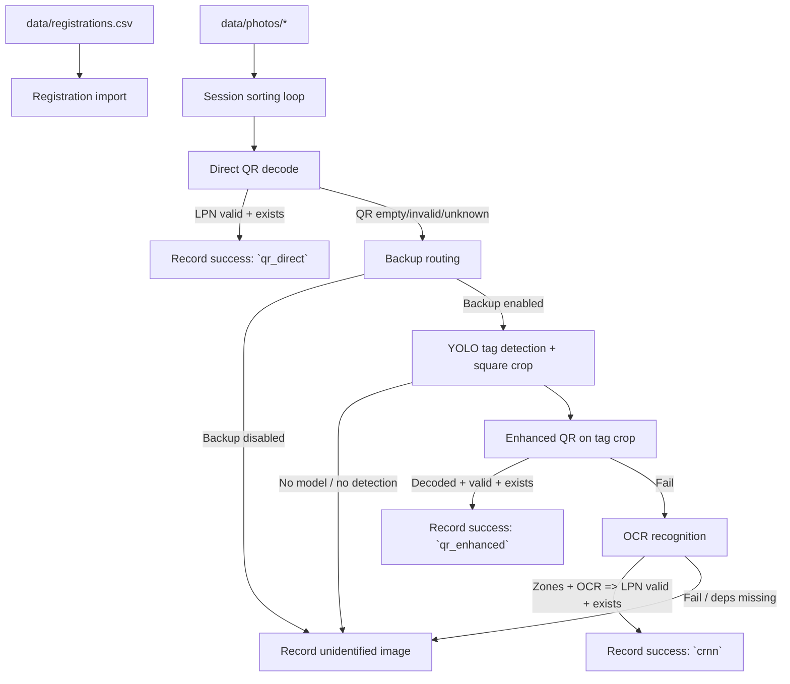

**Baggage Identification Backup Subsystem**

System Description (Current Implementation)

Last updated: 2026-06-04

# 1. Overview

This project is a web-based demonstration system that simulates an airport baggage identification pipeline and shows how a backup identification subsystem reduces failed baggage identification when direct QR decoding does not work.

The application processes a batch of baggage tag photos against a registration list. It runs a QR-first identification attempt in the main modes, then routes unreadable cases into the computer-vision backup flow:

- YOLO tag detection to isolate the tag region
- enhanced QR attempts on the tag crop
- OCR on detected LPN text zones as the final fallback

The system is designed for interactive thesis/diploma defense presentation. It provides a live pipeline UI with real-time block updates and stores per-session outcomes in SQLite for later comparison.

# 2. Goals, Audience, And Use Cases

## 2.1 Goals

- Demonstrate a complete identification pipeline with an integrated backup subsystem.
- Provide real-time visual feedback suitable for a presentation, including block states and counters.
- Persist outcomes per session for post-run comparison.
- Keep the system runnable even when optional ML/OCR dependencies or model weights are missing by degrading gracefully to unidentified images.

## 2.2 Intended Audience

- Diploma/thesis committee and supervisors.
- Project author iterating on CV/OCR strategies and presentation flow.
- Anyone reviewing the architecture of a QR-first plus CV-backup pipeline.

## 2.3 Primary Use Cases

- Live demo: run a session on a fixed dataset and show how the counters change.
- Mode comparison: run multiple sessions and compare identified versus lost counts and method breakdown.
- Failure analysis: inspect the unidentified images list to understand which photos failed and why.
- Debugging improvements: open processed images, tag crops, or enhanced variants to evaluate intermediate outputs.

# 3. Key Concepts

## 3.1 LPN As Primary Identifier

Each baggage registration is keyed by LPN (License Plate Number), formatted as:

- `NNNN NNNNNN` (4 digits, space, 6 digits)

The QR payload is expected to contain only the LPN. A decoded LPN is accepted as a valid identification only when it matches the expected format and exists in the registration table.

## 3.2 Sessions

Each run is a session identified by a UUID. A session:

- processes all images found under `data/photos/`
- copies originals into `data/sessions/<session_id>/original/`
- writes processed artifacts into `data/sessions/<session_id>/processed/` when applicable
- stores results in SQLite for later viewing on `/results`

On app start, the database is recreated and `data/sessions/` is cleared.

# 4. Technical Architecture

## 4.1 Tech Stack

| Layer | Technology |
|---|---|
| Backend | Python, Flask |
| Real-time UI updates | Flask-SocketIO (threading mode) |
| Database | SQLite + SQLAlchemy ORM |
| CV / Image IO | OpenCV (`opencv-python-headless`) |
| Object detection | Ultralytics YOLOv8 (`ultralytics`) |
| OCR | EasyOCR (`easyocr`) |
| Frontend | HTML/CSS + vanilla JavaScript |

## 4.2 Backend Components

- `app.py`:
  - HTTP routes (`/`, `/results`, REST APIs)
  - Socket.IO event emission
  - session worker thread spawning
- `database/`:
  - SQLite connection/session management and startup reset
  - ORM models for registrations and results
- `subsystem/`:
  - `registration.py`: CSV import into DB
  - `sorting.py`: session loop over photos and direct QR routing
  - `detection.py`: YOLO tag detection, crop generation, routing to enhancement or recognition
  - `enhancement.py`: iterative image variants for improved QR decoding
  - `recognition.py`: YOLO zone detection, OCR, and LPN reconciliation
  - `results.py`: DB writes and counter update events

## 4.3 Frontend Components

- `static/index.html` and `static/app.js`:
  - live pipeline dashboard with blocks 1.1 to 2.3 and counters 1.3/1.4
  - mode selection and Start Session
  - real-time updates via Socket.IO
- `static/results.html` and `static/app.js`:
  - session history table
  - per-session drill-down with per-registration results and matched images
  - separate unidentified images table
  - fullscreen image preview modal

# 5. Processing Pipeline

The pipeline is executed in a background thread per session so HTTP requests remain responsive.



## 5.1 Registration Import

At the start of the first session after app launch, the system imports registrations from `data/registrations.csv` into the `baggage_registrations` table.

Behavior:

- validates CSV headers strictly
- rejects rows with any empty cell
- runs only once per app start because the database is recreated on startup

## 5.2 Sorting Loop

For each image in `data/photos/` with a supported suffix (`.jpg`, `.jpeg`, `.png`, `.bmp`, `.webp`):

1. Copy the image to `data/sessions/<session_id>/original/`
2. Try direct QR reading if enabled by mode
3. If not identified and backup is enabled:
   - detect and crop the tag region
   - attempt enhanced QR variants on the tag crop
   - attempt OCR zone recognition in full mode
4. Record success or store the image as unidentified

Photo filenames are not used as the source of truth for identification. Decoded values drive the result.

# 6. Modes And Feature Flags

Modes are defined in `config.py` and served to the UI via `GET /api/modes`. The UI disables optional pipeline blocks based on the selected mode.

As implemented, the key switches are:

- `direct_qr`: attempt QR on the original image
- `yolo`: enable backup routing into tag detection
- `enhanced_qr`: attempt enhanced QR decoding on the detected tag crop
- `crnn`: attempt zone detection plus OCR on the tag crop

Current mode set includes only:

| Mode | `direct_qr` | `yolo` | `enhanced_qr` | `crnn` | Intended purpose |
|---|---:|---:|---:|---:|---|
| `basic` | ✓ | ✗ | ✗ | ✗ | baseline QR-only mode |
| `enhanced` | ✓ | ✓ | ✓ | ✗ | QR-first with enhanced QR backup |
| `full` | ✓ | ✓ | ✓ | ✓ | QR-first with enhanced QR and OCR fallback |

# 7. Data Storage And Database Model

## 7.1 Startup Reset

On application start, the system:

- drops and recreates all SQLite tables
- deletes and recreates `data/sessions/`

This keeps demos reproducible but means previous session history is not preserved across app restarts.

## 7.2 Session Artifacts

Session artifacts are stored under:

- `data/sessions/<session_id>/original/` for original photo copies
- `data/sessions/<session_id>/processed/` for optional intermediate outputs

Artifacts are served by Flask via:

- `GET /static/sessions/<path>`

## 7.3 Database Tables

- `baggage_registrations`
  - imported from CSV, one row per registered LPN
- `sorting_results`
  - one row per `(session_id, lpn)`
  - used as the registration-centric drill-down basis
- `matched_image_results`
  - one row per successful matched photo
  - supports multiple photos per LPN
  - stores `qr_strategy` when identification came from a QR attempt
- `unidentified_image_results`
  - one row per photo that did not produce a valid registered LPN
  - may include a `processed_image_path` for debugging

Important interpretation:

- Live Identified/Lost counters operate on processed images.
- Session summary totals on `/results` also operate on processed images.
- The drill-down table remains registration-centric for comparison and review.

# 8. Interfaces

## 8.1 HTTP Routes

- `GET /` pipeline UI
- `GET /results` session history UI
- `GET /api/modes` list modes and current selection
- `POST /api/set_mode` set mode, blocked while running
- `POST /api/start` start a session and return `202 Accepted`
- `GET /api/results/sessions` session summary table data
- `GET /api/results/session/<session_id>` session drill-down data
- `GET /static/sessions/<path>` serve session images

## 8.2 Socket.IO Events

- `session_started`: emitted when a session begins
- `session_finished`: emitted when a session ends
- `block_update`: emitted for block status changes and progress counters
- `counter_update`: emitted when Identified/Lost counters change, including method breakdown

# 9. Configuration And ML Model Integration

## 9.1 Paths And Constants

Configuration lives in `config.py`:

- `DATA_DIR`, `PHOTOS_DIR`, `CSV_PATH`, `SESSIONS_DIR`
- YOLO weights paths (`MODEL_DETECT`, `MODEL_ZONES`)
- confidence thresholds, expected zone classes, and image sizing constants
- `MODES` dictionary

## 9.2 Dependency / Model Availability

The backup subsystem depends on:

- `ultralytics` plus detector weights (`MODEL_DETECT`)
- `ultralytics` plus zones weights (`MODEL_ZONES`)
- `easyocr` for OCR

If a dependency or weights file is missing, the corresponding stage is skipped and the image is recorded as unidentified.

# 10. Running The System

Prerequisites:

- Python environment with dependencies from `requirements.txt`
- populated `data/registrations.csv` and `data/photos/`

Local run:

```powershell
.\.venv\Scripts\Activate.ps1
python app.py
```

Then open:

- `http://127.0.0.1:5000/` for the pipeline view
- `http://127.0.0.1:5000/results` for session history

# 11. Known Limitations And Next Improvements

- Detection preprocessing currently crops the photo to a centered square before YOLO detection. That keeps the detector input consistent, but it assumes the tag is reasonably centered.
- Model weights are referenced from the training output tree under `runs/`. For deployment, copying the selected weights into `models/` would make the layout simpler.
- The system focuses on demo correctness and interpretability, not throughput.
- QR and OCR pipelines may require tuning for different cameras, print quality, blur, glare, and motion.
