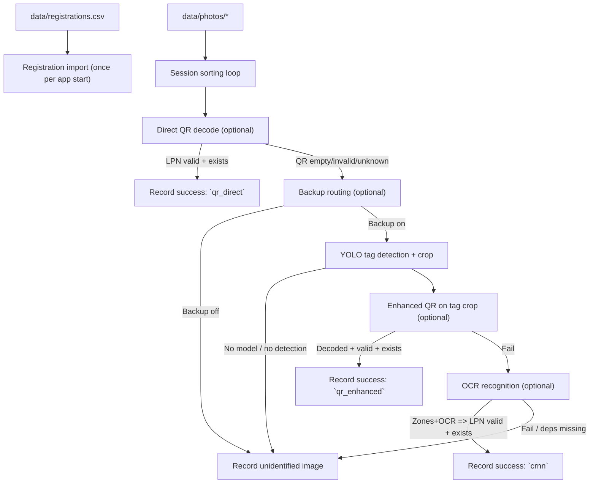

**Baggage Identification Backup Subsystem**

System Description (Implemented Demo + Intended Use)

Last updated: 2026-05-19

# 1. Overview

This project is a web-based demonstration system that simulates an airport baggage identification pipeline and showcases how a *backup identification subsystem* can reduce “lost/unidentified” baggage items when the primary identification method (QR decoding) fails.

The system processes a batch of baggage tag photos against a registration list. It runs a QR-first identification attempt, and (depending on the selected mode) routes failures into a computer-vision backup flow:

- YOLO tag detection → crop tag region
- enhanced QR attempts on the crop
- OCR on detected LPN text zones as a final fallback

The application is designed for interactive thesis/diploma defense presentation: it provides a live “pipeline” UI with real-time block status updates and stores per-session outcomes in SQLite so multiple sessions can be compared.

# 2. Goals, Audience, And Use Cases

## 2.1 Goals

- Demonstrate a complete identification pipeline with an optional backup subsystem.
- Provide real-time visual feedback suitable for a presentation (block states + counters).
- Persist outcomes per session for post-run comparison (with/without backup, different strategies).
- Keep the system runnable even when optional ML/OCR dependencies or model weights are missing (graceful degradation to “unidentified”).

## 2.2 Intended Audience

- Diploma/thesis committee and supervisors (demo + evidence).
- Project author (iteration on CV/OCR strategies and presentation).
- Anyone reviewing the architecture of a QR-first + CV-backup pipeline.

## 2.3 Primary Use Cases

- **Live demo:** run a session on a fixed dataset and show how identification counters change.
- **Mode comparison:** run multiple sessions with different modes and compare Identified/Lost and method breakdown.
- **Failure analysis:** inspect the “unidentified images” list to understand which photos fail and why.
- **Debugging improvements:** open processed images (tag crops / enhanced variants) to evaluate intermediate outputs.

# 3. Key Concepts

## 3.1 LPN As Primary Identifier

Each baggage registration is keyed by **LPN** (License Plate Number), formatted as:

- `NNNN NNNNNN` (4 digits, space, 6 digits)

The QR payload is expected to contain only the LPN. A decoded LPN is accepted as a *valid identification* only when it matches the expected format and exists in the registration table.

## 3.2 Sessions

Each run is a **session** identified by a UUID. A session:

- processes all images found under `data/photos/`
- copies originals into `data/sessions/<session_id>/original/`
- optionally writes processed artifacts into `data/sessions/<session_id>/processed/`
- stores results in SQLite for later viewing on `/results`

Important: on app start, the database is recreated and `data/sessions/` is cleared (see Section 7).

# 4. Technical Architecture

## 4.1 Tech Stack

| Layer | Technology |
|---|---|
| Backend | Python, Flask |
| Real-time UI updates | Flask-SocketIO (threading mode) |
| Database | SQLite + SQLAlchemy ORM |
| CV / Image IO | OpenCV (opencv-python-headless) |
| Object detection | Ultralytics YOLOv8 (`ultralytics`) |
| OCR | EasyOCR (`easyocr`) |
| Frontend | HTML/CSS + vanilla JavaScript |

## 4.2 Backend Components

- `app.py`:
  - HTTP routes (`/`, `/results`, REST APIs)
  - Socket.IO event emission
  - session worker thread spawning
- `database/`:
  - SQLite connection/session management and startup reset
  - ORM models for registrations and results
- `subsystem/`:
  - `registration.py`: CSV import into DB
  - `sorting.py`: session loop over photos, primary QR attempt + routing
  - `detection.py`: YOLO tag detection + crop + routing to enhancement/recognition
  - `enhancement.py`: iterative image variants for improved QR decoding
  - `recognition.py`: YOLO zone detection + OCR + LPN reconciliation
  - `results.py`: DB writes + counter aggregation events

## 4.3 Frontend Components

- `static/index.html` + `static/app.js`:
  - live “pipeline” dashboard (blocks 1.1–2.3 + counters 1.3/1.4)
  - mode selection + Start Session
  - real-time updates via Socket.IO events
- `static/results.html` + `static/app.js`:
  - session history table
  - per-session drill-down (per-registration results + matched images)
  - separate “unidentified images” table
  - fullscreen image preview modal

# 5. Processing Pipeline (As Implemented)

The pipeline is executed in a background thread per session so HTTP requests remain responsive.



## 5.1 Registration Import

At the start of the first session after app launch, the system imports registrations from `data/registrations.csv` into the `baggage_registrations` table.

Behavior:

- validates CSV headers strictly (exact expected set and order)
- rejects rows with any empty cell
- runs only once per app start because the database is recreated on startup

## 5.2 Sorting Loop (Per Photo)

For each image in `data/photos/` (supported suffixes: `.jpg`, `.jpeg`, `.png`, `.bmp`, `.webp`):

1. Copy image to `data/sessions/<session_id>/original/`
2. Try direct QR reading if enabled by mode
3. If not identified and backup is enabled:
   - detect and crop tag region
   - attempt enhanced QR variants
   - attempt OCR zone recognition (full modes)
4. Record success or store the image as “unidentified”

Note: the system does not assume a photo filename-to-LPN mapping. Identifications are driven by decoded values.

# 6. Modes And Feature Flags

Modes are defined in `config.py` and served to the UI via `GET /api/modes`. The UI disables optional pipeline blocks based on the selected mode.

As implemented, the key switches are:

- `direct_qr`: attempt QR on the original image
- `yolo`: enable backup routing into tag detection
- `enhanced_qr`: attempt enhanced QR decoding on the detected tag crop
- `crnn`: attempt zone detection + OCR on the tag crop

Current mode set includes:

| Mode | `direct_qr` | `yolo` | `enhanced_qr` | `crnn` | Intended purpose |
|---|---:|---:|---:|---:|---|
| `basic` | ✓ | ✗ | ✗ | ✗ | baseline (QR-only) |
| `enhanced` | ✓ | ✓ | ✓ | ✗ | QR + detection + enhanced QR |
| `full` | ✓ | ✓ | ✓ | ✓ | full backup: enhanced QR + OCR fallback |
| `qr_enhanced_only` | ✗ | ✓ | ✓ | ✗ | measure enhanced QR without direct stage |
| `ocr_only` | ✗ | ✓ | ✗ | ✓ | measure OCR fallback without QR stages |

# 7. Data Storage And Database Model

## 7.1 Startup Reset

On application start, the system:

- drops and recreates all SQLite tables
- deletes and recreates `data/sessions/`

This keeps demos reproducible but means *previous session history is not preserved across app restarts*.

## 7.2 Session Artifacts

Session artifacts are stored under:

- `data/sessions/<session_id>/original/` (original photo copies)
- `data/sessions/<session_id>/processed/` (optional intermediate outputs)

Artifacts are served by Flask via:

- `GET /static/sessions/<path>`

## 7.3 Database Tables (Logical View)

- `baggage_registrations`
  - imported from CSV, one row per registered LPN
- `sorting_results`
  - one row per `(session_id, lpn)` (pre-initialized as `failed/none`)
  - becomes `success/<method>` once at least one photo identifies that LPN
- `matched_image_results`
  - one row per successful matched photo (supports multiple photos per LPN)
  - stores `qr_strategy` when identification came from a QR attempt
- `unidentified_image_results`
  - one row per photo that did not produce a valid registered LPN
  - may include a `processed_image_path` (e.g., tag crop) for debugging

Important interpretation:

- **Identified/Lost counters** operate on the *registration set* (one outcome per registered LPN per session).
- **Matched/Unidentified image lists** operate on the *photo set* (one outcome per processed photo).

# 8. Interfaces (HTTP + WebSocket)

## 8.1 HTTP Routes

- `GET /` pipeline UI
- `GET /results` results UI
- `GET /api/modes` list modes + current selection
- `POST /api/set_mode` set mode (blocked while running)
- `POST /api/start` start a session (returns `202 Accepted`)
- `GET /api/results/sessions` session summary table data
- `GET /api/results/session/<session_id>` session drill-down data
- `GET /static/sessions/<path>` serve session images

## 8.2 Socket.IO Events

- `session_started`: emitted when a session begins
- `session_finished`: emitted when a session ends
- `block_update`: emitted for block status changes (`pending`/`running`/`done`/`failed`) and progress counters
- `counter_update`: emitted when Identified/Lost counters change, including method breakdown

# 9. Configuration And ML Model Integration

## 9.1 Paths And Constants

Configuration lives in `config.py`:

- `DATA_DIR`, `PHOTOS_DIR`, `CSV_PATH`, `SESSIONS_DIR`
- YOLO weights paths (`MODEL_DETECT`, `MODEL_ZONES`)
- confidence thresholds, expected zone classes, image sizing constants
- `MODES` dictionary

## 9.2 Dependency / Model Availability

The backup subsystem depends on:

- `ultralytics` + detector weights (`MODEL_DETECT`)
- `ultralytics` + zones weights (`MODEL_ZONES`)
- `easyocr` for OCR

If a dependency or weights file is missing, the corresponding stage is skipped and the image is recorded as “unidentified” (with a `block_update` of `failed` for that stage).

# 10. Running The System

Prerequisites:

- Python environment with dependencies from `requirements.txt`
- populated `data/registrations.csv` and `data/photos/`

Local run:

```powershell
.\.venv\Scripts\Activate.ps1
python app.py
```

Then open:

- `http://127.0.0.1:5000/` (pipeline view)
- `http://127.0.0.1:5000/results` (session history)

# 11. Known Limitations And Next Improvements

- Detection preprocessing currently crops the photo to a centered square before YOLO detection. This assumes the tag is near the center; for broader datasets, consider running detection on the full image or using letterboxing.
- Model weights are referenced from the training output tree under `runs/`. For deployment, consider copying “best” weights into `models/` and pointing config there.
- The system focuses on demo correctness and interpretability, not throughput.
- QR and OCR pipelines may require tuning for different cameras, print quality, blur, glare, and motion.
